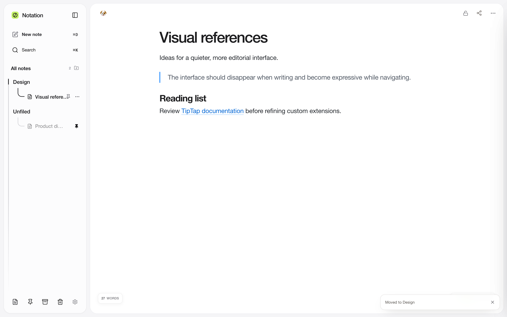

# Notation

Notation is a local-first, open-source notes app focused on fast writing, rich text, Markdown, backlinks, tables, images, and keyboard-driven navigation.



## What it does

- Rich text editing with headings, lists, highlights, links, code blocks, and task lists
- Editable tables inside the note surface
- Image and file attachments
- Wiki-style links and backlinks between notes
- Fast note and command search
- Markdown import and export
- PDF export
- Keyboard-first navigation and note actions
- Local-only storage with no account required

## Privacy and security

Notation is designed to run entirely on your device.

- No account or sign-in
- No backend or cloud database
- No analytics or telemetry
- No ads
- No remote note synchronization
- Notes and attachments are stored locally in the browser using IndexedDB
- UI preferences are stored in localStorage

The app does not upload your notes, attachments, credentials, or usage data to a server.

When exporting a note to PDF, Notation may fetch an image URL already embedded in that note so the image can be included in the generated PDF. Local images are stored as data URLs and do not require a network request.

## Run locally

Requirements:

- Node.js 20 or newer
- npm

```bash
npm install
npm run dev
```

Then open:

```text
http://localhost:3000
```

## Build

```bash
npm run typecheck
npm run build
```

The project uses Next.js static export, so the production site can be served as static files.

## Tests

```bash
npm run test:e2e
```

End-to-end tests use Playwright.

## Tech stack

- Next.js
- React
- TypeScript
- Tiptap / ProseMirror
- Zustand
- IndexedDB
- Playwright

## Project structure

```text
src/app/                 Next.js routes and global app setup
src/components/editor/   Editor UI and Tiptap extensions
src/components/workspace Workspace, navigation, search, settings
src/lib/data/            Local persistence
src/lib/export/          Markdown and PDF export
src/store/               Client-side state stores
public/landing/          Landing-page screenshots
```

## Data model

Workspace notes are stored in the browser database:

```text
Database: notation-local
Object store: workspace
Key: notes
```

Older localStorage data under `notation.local-notes.v1` is migrated automatically when present.

## Website

Project landing page: https://code-wizard-wilson.github.io/

Source code: https://github.com/Code-Wizard-Wilson/Notation

## License

Notation is released under the MIT License. See [LICENSE](LICENSE).
